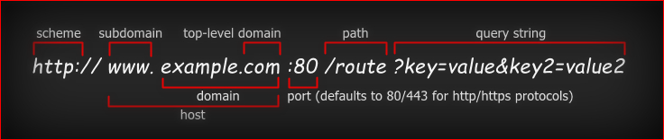

# Node.js HTTP Cookies

Provides an easier way to handle HTTP [cookies][http-cookie].

#### This library allows you to:

- Create string or json cookies with optional signature.
- Parse the HTTP [cookie][cookie-header] header and create a key-value pair object.
- Use the `cookie parser` middleware in [ExpressJS][expressjs].

> **Note**
> This is a lightweight alternative library to [cookie-parser][expressjs-cookie-parser] with no dependencies.

---

#### Brief introduction to cookies:

- A cookie can contain any US-ASCII characters except for: the control character, space, or a tab. It also must not contain separator characters like the following: `( ) < > @ , ; : \ " / [ ] ? = { }`.
- The cookie can be [URI encoded][encode-uri-component] to satisfy the allowed character requirement.
- The cookie value can be a [JSON-stringified][json-stringify] object or number, in which case the string will include the `j:` prefix.
- The cookie value can be [signed][create-hmac] to ensure that it has not been tampered with. The final string is prefixed with `s:`.

When the web browser sends a request, the server parses the cookies in the [cookie][cookie-header] header.

```js
'name=value; name2=value2'
```

When the server sends a response, cookies are set in the [Set-Cookie][set-cookie-header] header.

```js
[
    'name=value; attributes',   // cookie #1
    'name2=value2, attributes2' // cookie #2
]
```
You may find the [SameSite][same-site-header] attribute useful.
If the server stores a session token with full access to the user's account in the cookies, you don't want the browser to send it in a malicious request from an unauthorized site ([CSRF][csrf]).

To understand how `SameSite` works, it is first necessary to understand how [URL][url]s are structured.

<p align="center">
  
</p>

The [Public Suffix List][psl] (PSL) is a catalog of certain Internet domain names. Entries on the list are also referred to as **Effective Top-Level Domains** (eTLD).

The `SameSite` attribute allows you to declare if your cookie should be restricted to a **same-site** or **cross-site** context.
The included cookie is **first-party** when the request is made in a **same-site** context, and **third-party** when the request is made in a **cross-site** context.

- `None` — Cookies will be sent in responses to both contexts. The `Secure` attribute must also be set.
- `Lax` — Cookies will only be sent when a user is navigating to the origin site (i.e., when following a link).
- `Strict` — Cookies will only be sent in a **same-site** context.

The `same-site` context treats all subdomains of the `eTLD+1` to be equivalent to the root domain.

- Case 1: `www.example.com`, `xyz.example.com`, `x.y.z.example.com` and `example.com` are all treated as the same site. The `.com` is the [eTLD][etld], which together with `.example` conforms the `eTLD+1`, the rest are the subdomains.
- Case 2: `your-repo.github.io` and `my-repo.github.io` are considered different sites, because `github.io` is declared as a [eTLD][etld] in the [PSL][psl-data], the `your-repo` and `my-repo` are the `+1` part and the rest are the subdomains.

[User agents][user-agent] group [URI][uri]s together into protection domains called origins. Two [URI][uri]s are part of the same origin if they have the same scheme, host, and port (ref. [RFC6454][rfc6454-s32]).
All **cross-site** requests are necessarily **cross-origin**, but not all **cross-origin** requests are **cross-site**. See [CORS][cors].

## Installation

```
npm install https://github.com/flipeador/node-http-cookies
```

## Examples

<details>
<summary><h4>Cookie Parser</h4></summary>

```js
import {
    createCookie,
    parseSignedCookie,
    parseJsonCookie,
    parseCookieHeader
} from '@flipeador/node-http-cookies';

const secret = 'SIGNED_COOKIE_SECRET';

const strCookie = createCookie('str', 'str cookie');
const sigStrCookie = createCookie('sstr', 'sig str cookie', {secret});

const jsonCookie = createCookie('json', ['json cookie']);
const sigJsonCookie = createCookie('sjson', ['sig json cookie'], {secret});

const cookies = parseCookieHeader(
    `${strCookie};${sigStrCookie};${jsonCookie};${sigJsonCookie}`
);

for (let [key, value] of Object.entries(cookies))
{
    const signed = parseSignedCookie(value, secret);
    if (signed !== undefined) {
        value = `${signed}`;
        key += ' sig';
    }

    const json = parseJsonCookie(value);
    if (json !== undefined) {
        value = json;
        key += ' json';
    }

    console.log(`${key}:`, value);
}
```

```
str: str cookie
sstr sig: sig str cookie
json json: [ 'json cookie' ]
sjson sig json: [ 'sig json cookie' ]
```

</details>

<details>
<summary><h4>ExpressJS</h4></summary>

```js
import express from 'express';
import cookieParser from '@flipeador/node-http-cookies';

const server = express();

server.use(express.json());
server.use(cookieParser());

server.get('/api', (req, res) => {
    res.addCookie('name', 'value', {
        // options
        secret: 'SIGNED_COOKIE_SECRET',
        // cookie attributes
        'Max-Age': 1000, // expires in 1000 seconds
        'HttpOnly': true // true is ignored
    });
    res.status(200).json(req.cookies);
});

server.listen(8080, () => {
    console.log('Server is running!');
});
```

</details>

## License

This project is licensed under the **GNU General Public License v3.0**. See the [license file](LICENSE) for details.

<!-- REFERENCE LINKS -->
[expressjs]: https://github.com/expressjs/express "@expressjs/express"
[expressjs-cookie-parser]: https://github.com/expressjs/cookie-parser "@expressjs/cookie-parser"

[user-agent]: https://developer.mozilla.org/docs/Glossary/User_agent

[uri]: https://en.wikipedia.org/wiki/Uniform_Resource_Identifier "Uniform Resource Identifier"
[url]: https://en.wikipedia.org/wiki/URL "Uniform Resource Locator"

[cors]: https://developer.mozilla.org/docs/Web/HTTP/CORS "Cross-Origin Resource Sharing"
[csrf]: https://en.wikipedia.org/wiki/Cross-site_request_forgery "Cross-Site Request Forgery"

[http-cookie]: https://en.wikipedia.org/wiki/HTTP_cookie "HTTP Cookie"

[cookie-header]: https://developer.mozilla.org/docs/Web/HTTP/Headers/Cookie "HTTP Cookie Header"
[set-cookie-header]: https://developer.mozilla.org/docs/Web/HTTP/Headers/Set-Cookie "HTTP Set-Cookie Header"
[same-site-header]: https://developer.mozilla.org/docs/Web/HTTP/Headers/Set-Cookie/SameSite "HTTP SameSite Header"

[json-stringify]: https://developer.mozilla.org/docs/Web/JavaScript/Reference/Global_Objects/JSON/stringify "JSON-stringify"
[encode-uri-component]: https://developer.mozilla.org/docs/Web/JavaScript/Reference/Global_Objects/encodeURIComponent "encodeURIComponent"

[create-hmac]: https://nodejs.org/api/crypto.html#cryptocreatehmacalgorithm-key-options "Node.js crypto#createHmac"

[psl]: https://publicsuffix.org "Public Suffix List"
[etld]: https://publicsuffix.org "Effective Top-Level Domain"
[psl-data]: https://github.com/publicsuffix/list/blob/master/public_suffix_list.dat "Public Suffix List (file)"

[rfc6454-s32]: https://www.rfc-editor.org/rfc/rfc6454#section-3.2 "RFC 6454 Section 3.2"
